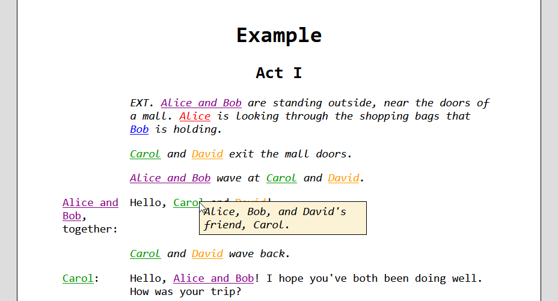

# webplay

This program takes a play from a text file and generates a web-friendly version.


## Play format
Each directive, line of narrative, and line of dialogue should be separated by a
blank line.

```
# Comment               - These lines are ignored.

@!First-level heading   - Output as <h1>Heading</h1>
                          The first first-level heading will be used as the
                          title of the HTML page.

@!!Second-level heading - Output as <h2>Heading</h2>

@~Un-paragraphed text   - Output without wrapping in a paragraph element

@Name: Description      - A character (or group of characters) in the play
                          The HTML will be generated so that the description may
                          be displayed upon mouse hover using CSS or JavaScript.
                          Character descriptions can be redefined by declaring
                          the character again with a different description.

Name: Dialogue          - Output wrapped in a paragraph element

A line of narrative.    - Output wrapped in a paragraph element
```


## Styling with CSS

The HTML output will contain elements with the following classes:

|Element|Class      |Notes                                                                             |
|-------|-----------|----------------------------------------------------------------------------------|
|p      |dialogue   |Container for `.character` (name of the speaker) and `.line`.                     |
|span   |character  |Container for `.description`. Contains the name of a character.                   |
|span   |description|Contains a character's description. Intended to be hidden until mouse hover/click.|
|span   |line       |Contains a line of dialogue.                                                      |
|p      |notes      |Contains Non-dialogue text.                                                       |


## Running the program

- The play text should be sent to standard input.
- The HTML file will be printed to standard output.

```
webplay.py [-c CSS_HREF...] [-s JS_SRC...] [-l HTML_LANG] <play.txt >output.html
```

|Argument|Notes                                                                        |
|--------|-----------------------------------------------------------------------------|
|`-c`    |If specified, these values will be included as stylesheets.                  |
|`-s`    |If specified, these values will be included as script elements.              |
|`-l`    |If specified, this will be set as the `lang` attribute of the `html` element.|


## Example

```
@!Example

@!!Act I

# Groups must be defined before their individual components.
@Alice and Bob: Often found together, sometimes with their friends Carol and
David.

@Alice: Often found with Bob. Carol and David's friend.

@Bob: [img!bob.png A picture of Bob]

@Carol: Alice, Bob, and David's friend, Carol.

@David: Alice, Bob, and Carol's friend, David.

EXT. Alice and Bob are standing outside, near the doors of a mall. Alice is
looking through the shopping bags that Bob is holding.

Carol and David exit the mall doors.

Alice and Bob wave at Carol and David.

Alice and Bob, together: Hello, Carol and David!

Carol and David wave back.

Carol: Hello, Alice and Bob! I hope you've both been doing well. How was your
        trip?
```


